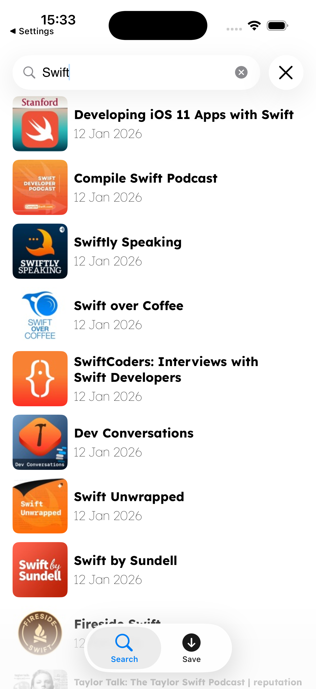
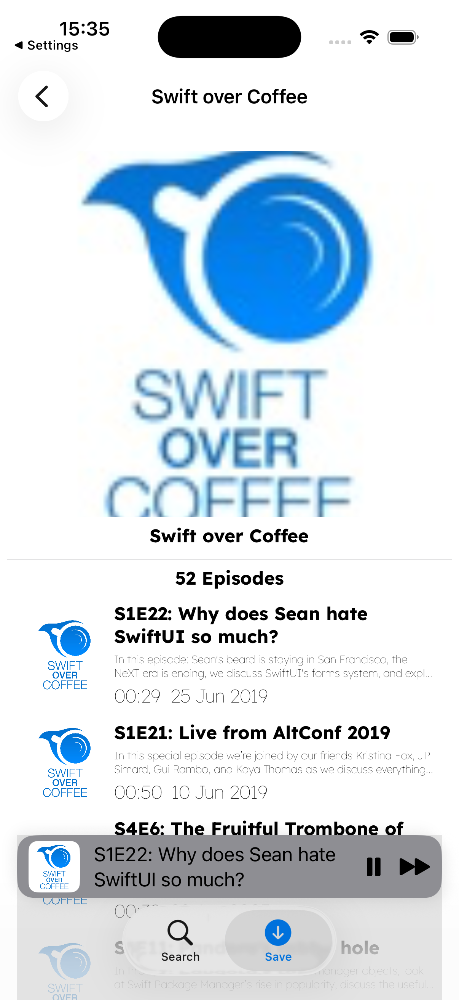
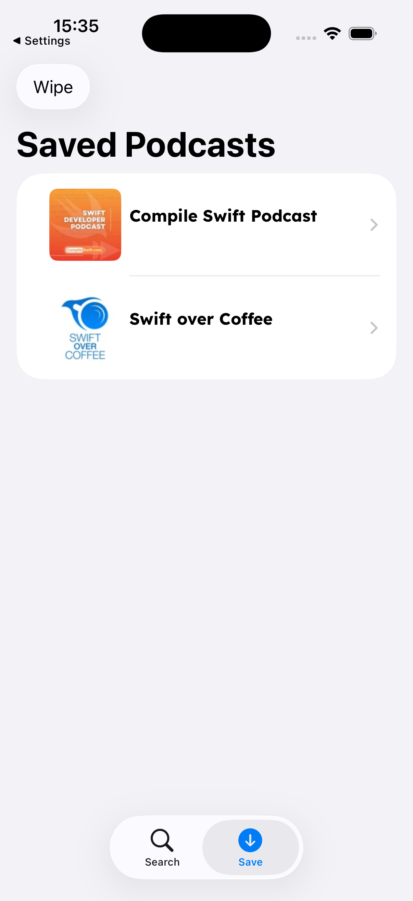
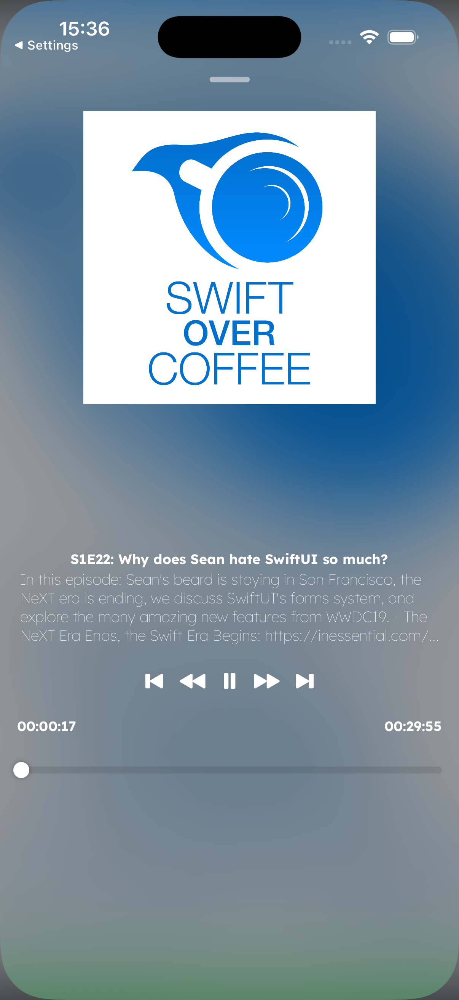

# CastHub – Modern Podcast Player for iOS

A clean, modern, offline-first podcast client built with **SwiftUI + MVVM Clean Architecture** in **Swift 6**.

Leverages:
- **iTunes Search API** for discovery
- **FeedKit** for RSS/Atom feed parsing
- **SwiftData** for subscriptions & download state persistence
- Custom lightweight networking layer → **IBToolkit**
  
## Main Features
- Search podcasts using iTunes Search API
- Subscribe / unsubscribe to podcasts (persisted with SwiftData)
- Automatic episode refresh from RSS feeds
- Stream & background audio playback
- Download episodes for offline listening
- Clean minimalistic SwiftUI interface
- Dark mode & dynamic type support
- Clean Architecture
- Swift 6

## 🏗 Architecture Overview

Key principles followed:

- **Single responsibility** for each layer/component
- **Dependency inversion** (protocols instead of concrete types)
- **Testability** (easy to mock repositories & use cases)
- **Offline-first** philosophy
- Separation between **business logic** and **data fetching/persistence**

## 🛠 Tech Stack

| Category              | Technology                          | Purpose                                    |
|-----------------------|-------------------------------------|--------------------------------------------|
| UI                    | SwiftUI                             | Declarative UI                             |
| Architecture          | MVVM + Clean Architecture           | Maintainable & testable structure          |
| Persistence           | SwiftData                           | Subscriptions                              |
| Networking            | IBToolkit (custom)                  | Type-safe API client, interceptors, retry  |
| RSS Parsing           | FeedKit                             | Reliable podcast feed parsing              |
| Search                | iTunes Search API                   | Podcast discovery                          |
| Audio Playback        | AVKit                               | Background playback & remote controls      |
| Async / Concurrency   | Swift Concurrency (async/await)     | Modern, safe asynchronous code             |
| Dependency Injection  | Manual / Factory / Environment      | Loose coupling & testability               |

## 📱 Screenshots

*screenshots*

| Search             | Podcast Detail         | Subscribed             | Player                 |
|--------------------|------------------------|------------------------|------------------------|
|           |               |             |               |

## 🚀 Getting Started

### Prerequisites

- macOS 15+ / Xcode 16+
- iOS 17.0+

